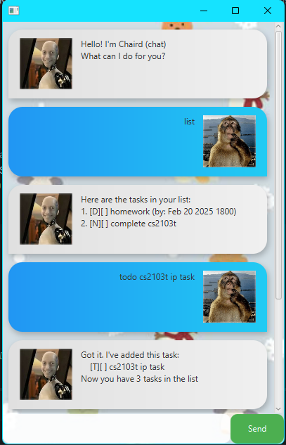

# Chaird(chat) User Guide



> Chaird is your JavaFX-powered task manager with a chat-style interface for __tracking tasks and taking notes.__

## Feature list

- `todo` - Quick tasks (no deadlines)
- `deadline` - Tasks with due dates  
- `event` - One-time events
- `note` - Note taking
- `list` - Displays all tasks and notes in tasklist
- `mark` - Mark tasks as done
- `unmark` - Unmark tasks as done
- `delete` - Delete tasks from tasklist
- `find` - Find tasks containing keyword
- `bye` - Exits application

## Adding todo tasks

use `todo` before typing in a task to create a todo task in Chaird

**Examples:**   

```
todo homework
todo geography homework
```

## Adding deadline tasks

Use `deadline` + task + /by + **YYYY-MM-DD HHMM**:

**Examples:**

```
deadline homework /by 2026-09-05 1759
deadline cs2103t ip /by 2026-02-20 1600
```

> 📝 **NOTE** 
> Please input the date for deadline tasks following the format strictly. 

## Adding event tasks

Use `event` + description + /from + **YYYY-MM-DD HHMM**:

**Examples:**

```
event TA meeting /from 2026-02-20 1400
```

## Adding notes

Use `note` before typing in a note

**Examples:**

```
note remember to redo quiz
```

> 📝 **NOTE** 
> Take note that notes cannot be marked or unmarked

## Lists

Simply type `list` to see all tasks and notes saved in the application

## Marking tasks

Type `mark` followed by the number aassociated to the task

```
mark 1 (marking task 1)
```

## Unmarking tasks

Type `unmark` followed by the number aassociated to the task

```
unmark 1 (marking task 1)
```

> [!TIP]
> Similar to mark, use `list`

## Deleting tasks

Type `delete` followed by the number aassociated to the task

```
delete 2
```

> ⚠️ **CAUTION** 
> Do use the `list` command to see the new tasks numbers after every delete to avoid confusion


## Finding tasks

Use `find` + keyword you wish to search 

**Examples:**

```
find homework
find CS2103T
```

## Closing the aapplication

Type `bye` to exit the application